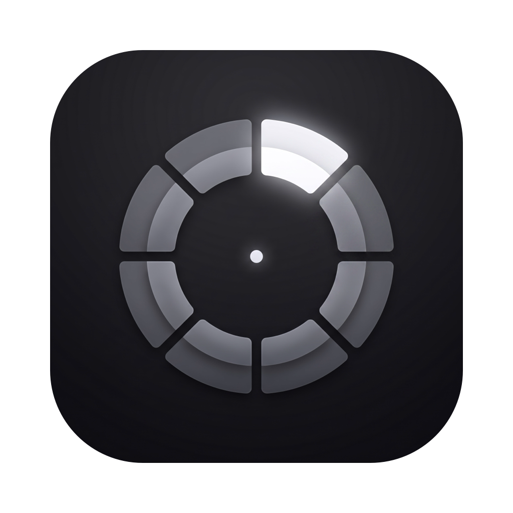

<p align="center">
  
</p>

<h1 align="center">Snip</h1>

<p align="center">
  A radial snippet menu for your Mac's menu bar.<br>
  Hold a trigger, drag to a wedge, release — the snippet lands at your cursor.
</p>

<p align="center">
  
  
  
</p>

---

## Features

- **Radial menu at the cursor** -- hold the trigger and a frosted ring blooms under the pointer; drag to a wedge and release to insert
- **Three trigger gestures** -- hold the middle button, hold a side/thumb button or keyboard shortcut, or double-click-and-hold a mouse button
- **Inserts into any app** -- paste-and-restore into the frontmost app, putting your clipboard back afterwards
- **Caret placement** -- put `$|` in a snippet and the cursor lands exactly there after insertion
- **Live tokens** -- `{date}`, `{time}`, and `{clipboard}` expand at insert time
- **Magnifying hub** -- the ring's center is a live loupe that magnifies whatever is behind the overlay
- **Works over fullscreen apps** -- the ring floats above native-fullscreen windows
- **Ring editor** -- arrange snippets on a visual dial in the library; drag positions to swap them
- **Per-app exceptions** -- suppress the trigger in apps that need the button (e.g. Blender's orbit)
- **Follows your accent** -- the entire UI keys off the system accent color
- **Start at login** -- optional login item, toggled in Settings
- **Auto-update** -- checks for updates via Sparkle, with one-click install from GitHub Releases

## Install

```sh
brew install --cask hex/tap/snip
```

Or [download the latest release](https://github.com/hex/Snip/releases/latest) from GitHub Releases. The app is Developer ID signed and notarized.

### Build from Source

**Prerequisites:**

| Requirement | Minimum |
|---|---|
| macOS | 14.0 (Sonoma) |
| Xcode | 16.0 |
| XcodeGen | 2.38 |

```sh
brew install xcodegen     # if not installed
xcodegen generate
open Snip.xcodeproj       # build and run with Cmd+R
```

Or from the command line:

```sh
xcodegen generate
xcodebuild -project Snip.xcodeproj -scheme Snip -configuration Debug build
```

## Usage

Snip lives in the menu bar. Set a trigger in Settings (default: hold the middle mouse button). Hold it anywhere, in any app: the ring opens under your cursor. Drag toward a wedge to light it up, release to insert that snippet at the cursor. Release in the middle to cancel.

Open **Settings** from the menu bar icon to manage everything: edit snippet text, assign snippets to ring positions on the dial and drag positions to rearrange, choose your trigger gesture, and set per-app exceptions.

## Permissions

Snip needs the **Accessibility** permission (System Settings → Privacy & Security → Accessibility) for two things:

- observing the trigger (a `CGEventTap` watches for your held button or shortcut)
- inserting text (a synthesized paste into the frontmost app)

Everything stays on your Mac: snippets are stored locally as JSON in `~/Library/Application Support/Snip/`, and the app sends no telemetry. The only network request Snip makes is the Sparkle update check against this repository.

## Architecture

```
CGEventTap (trigger gesture)
    |
EventTapEngine -- arm, detect hold/double-click, suppress per-app
    |
OverlayPanelController -- borderless non-activating panel, radial ring + loupe hub
    |
RadialGeometry (SnipKit) -- wedge hit-testing from the drag vector
    |
PasteEngine -- token resolution, paste-and-restore, caret placement
```

Pure logic lives in the **SnipKit** SwiftPM package (models, radial geometry, token resolver, JSON store, coordinate math) with its own test suite. The app target is a thin AppKit shell (`LSUIElement` agent) hosting SwiftUI.

## Project Structure

```
Snip/
├── project.yml             # XcodeGen configuration (source of truth)
├── SnipKit/                # Pure-logic SwiftPM package + unit tests
├── Snip/
│   ├── AppDelegate.swift       # Status item, event tap, windows
│   ├── AppModel.swift          # Observable app state + persistence
│   ├── UpdaterController.swift # Sparkle auto-update integration
│   └── UI/                     # Ring overlay, library, settings (SwiftUI)
└── docs/                   # Design specs and plans
```

## Testing

```sh
swift test --package-path SnipKit
```

## Versioning

Snip uses calendar versioning: **YYYY.M.PATCH** (`2026.7.0` = first release of July 2026). The build number (`CFBundleVersion`) is date-encoded and monotonic; Sparkle compares it to decide when to offer updates.

## License

MIT
